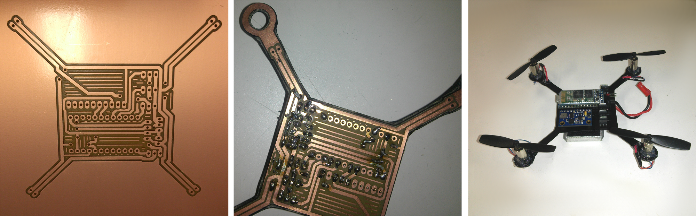

# QR2.0
This repository contains everything needed to build, tune and fly an Arduino based micro quadcopter.
The base of the quadcopter is made out of a prototype PCB cut with a CNC. Tuning of the controller parameters can be done using a Processing sketch.
The quadcopter can be flown with an Android based controller that sends commands over Bluetooth.

Parts Used:

  - Arduino Pro Micro 5V (Leonardo)
  - GY_80 10DOF IMU
  - JY-MCU HC-06 V1.03 Bluetooth module
  - 4.2V 46500RPM Magnetic Coreless Motor for RC Helicopters
  - 7.4V 350mAh LiPo Battery
